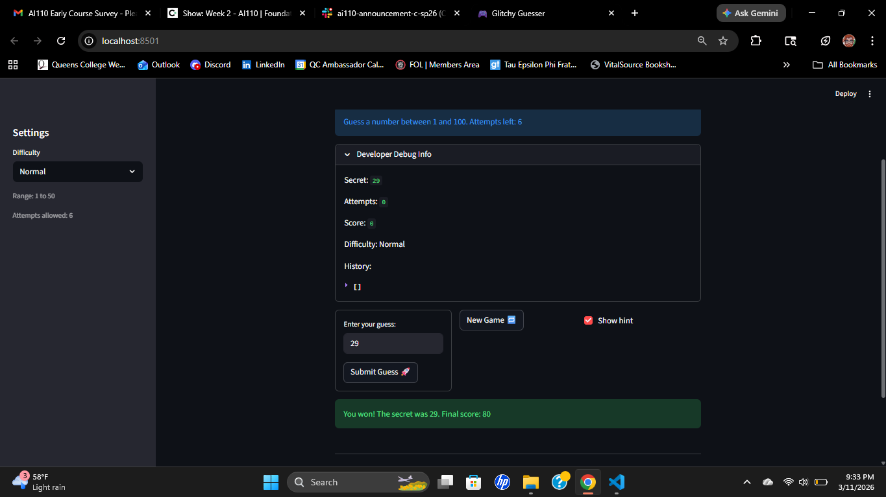

# 🎮 Game Glitch Investigator: The Impossible Guesser

## 🚨 The Situation

You asked an AI to build a simple "Number Guessing Game" using Streamlit.
It wrote the code, ran away, and now the game is unplayable. 

- You can't win.
- The hints lie to you.
- The secret number seems to have commitment issues.

## 🛠️ Setup

1. Install dependencies: `pip install -r requirements.txt`
2. Run the broken app: `python -m streamlit run app.py`

## 🕵️‍♂️ Your Mission

1. **Play the game.** Open the "Developer Debug Info" tab in the app to see the secret number. Try to win.
2. **Find the State Bug.** Why does the secret number change every time you click "Submit"? Ask ChatGPT: *"How do I keep a variable from resetting in Streamlit when I click a button?"*
3. **Fix the Logic.** The hints ("Higher/Lower") are wrong. Fix them.
4. **Refactor & Test.** - Move the logic into `logic_utils.py`.
   - Run `pytest` in your terminal.
   - Keep fixing until all tests pass!

## 📝 Document Your Experience

- It's a guessing game. The page sets up a random number, and the game is to guess the random within a given amount of attempts.
- [Issues with the hint system being inaccurate. The range of secret numbers between Normal and Hard difficulty needing to be swapped, same with the number of attempts between Easy and Normal difficulty. Allowing the Enter key to be able to input a guess. The range of the secret number would be within the range of the given difficulty.] Detail which bugs you found.
- Modified the st.form to allow key press of "Enter" to enter the the guess. Swapped the number of attempts between Easy and Hard. Used "low" and "high" in reassigning the secret number, such that the range alligned with the difficulty. Swapped the hints so that the page would prompt the user to go higher if their guess was too low, or lower if the guess was too high.

## 📸 Demo

- [ ] [Insert a screenshot of your fixed, winning game here]

## 🚀 Stretch Features

- [ ] [If you choose to complete Challenge 4, insert a screenshot of your Enhanced Game UI here]
